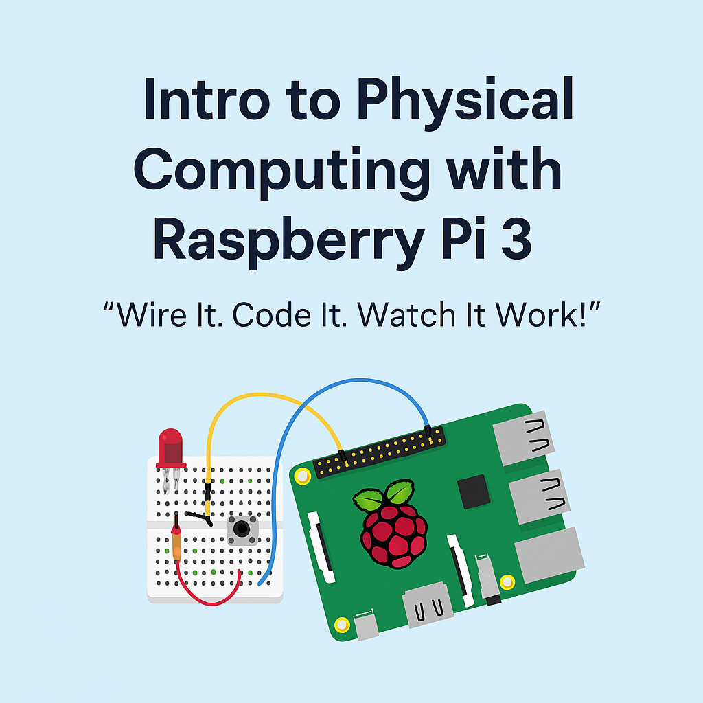

# 🔧 Intro to Physical Computing with Raspberry Pi 3
### *Wire It. Code It. Watch It Work!*

Welcome to the Raspberry Pi 3 Physical Computing Workshop! This 3-session program is designed for middle school students to explore hands-on electronics, coding, and creative projects using a Raspberry Pi 3.

---

## 📚 Lesson Plan Overview

### 🔹 [Session 1: Getting Started with Raspberry Pi & Physical Computing](./Session1_RPi3_Updated_PhysicalComputing.md)
- Introduction to Raspberry Pi 3 as a computer
- Write your first Python program
- Learn about GPIO and breadboards
- Blink an LED using GPIOZero

### 🔹 [Session 2: Inputs, Outputs, and Movement with GPIOZero](./Session2_RPi3_InputsOutputs.md)
- Use a button as input to control an LED
- Explore PWM to fade an LED
- Introduce servo and DC motors

### 🔹 [Session 3: Mini Project – Invent, Build, Show Off](./Session3_RPi3_MiniProject.md)
- Build a custom project with buttons, LEDs, buzzers
- Share and demo your invention with the group

---

## 🎯 Workshop Goals
- Build confidence in coding and problem-solving
- Learn core concepts in electronics and physical computing
- Spark creativity through hands-on experimentation

Let’s have fun and learn something new with Raspberry Pi!
